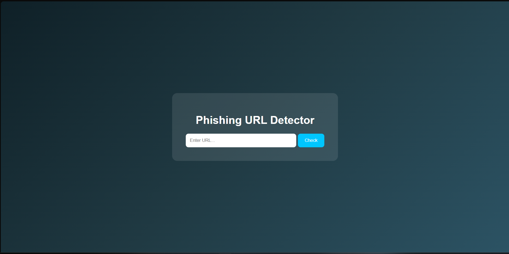
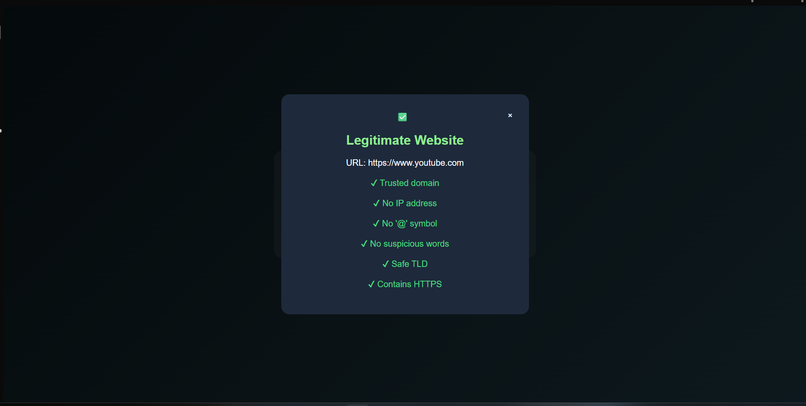
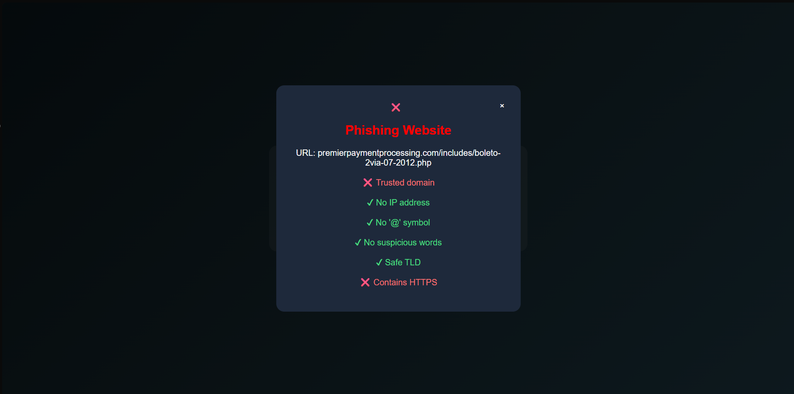

# Phishing URL Detection System 

A machine learning-based phishing URL detection system that classifies URLs as phishing or legitimate in real time using feature engineering and a Random Forest classifier.

The project combines machine learning with a Flask-based backend and a responsive frontend interface to provide fast and explainable phishing detection.

---

## Features

- Real-time phishing URL detection
- Machine learning classification using Random Forest
- Lightweight feature extraction pipeline
- Explainable predictions using URL-based indicators
- Flask backend for prediction handling
- Interactive frontend built with HTML, CSS, and JavaScript

---

## Tech Stack

### Machine Learning
- Python
- Scikit-learn
- Pandas
- NumPy

### Backend
- Flask

### Frontend
- HTML
- CSS
- JavaScript

---

## Dataset

- Trained on a dataset containing ~96,000 URLs
- Includes both phishing and legitimate URLs
- Feature-engineered dataset generated from raw URLs

---

## Feature Engineering

The system extracts multiple URL-based features including:

### Basic Features
- URL length
- Number of dots
- Digit-to-letter ratio
- Presence of special characters
- Entropy of URL

### Advanced Features
- Suspicious keywords
- Suspicious TLD detection
- Domain reputation checks
- HTTPS presence
- Subdomain analysis

---

## System Architecture

User Input → Feature Extraction → Random Forest Model → Prediction → Feature-Based Explanation

---

## Model Performance

- Random Forest Classifier
- Achieved approximately **90% accuracy** on test data

---

## Project Modules

### Feature Extraction Module
Extracts numerical features from URLs.

### Model Training Module
Trains and evaluates the Random Forest classifier.

### Backend Prediction API
Processes user input and returns predictions.

### Frontend Interface
Displays phishing detection results with visual indicators.

---

## Screenshots

### Homepage

### Legitimate Website Detection

### Phishing Website Detection

